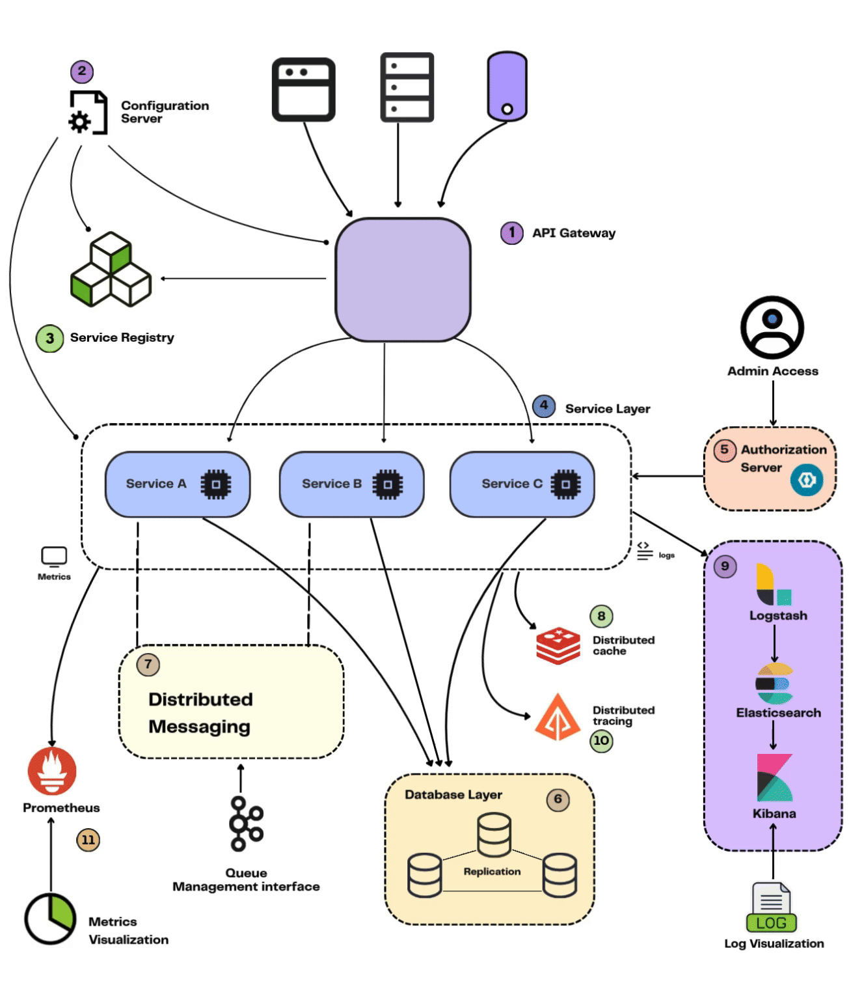
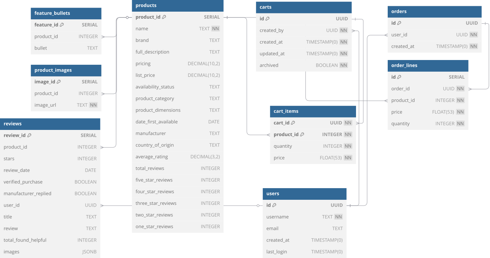

<h1 align="center">Trendy Traverse</h1>

## Overview
TrendyTraverse is a modern e-commerce application developed to showcase my expertise in [SpringBoot](https://spring.io/projects/spring-boot) and containerized microservices using [Docker](https://www.docker.com/).
 
It serves as a demonstration of building a scalable, secure, and efficient online shopping platform, integrating various technologies to replicate a real-world e-commerce experience.

<strong>Table&nbsp;of&nbsp;Contents</strong>

- [Requirements](#requirements)
- [Technologies Used](#technologies)
- [Installation and setup](docs/Setup.md)
- [Architecture](#architecture)
- [ER Diagram](#er-diagram)
- [API Endpoints](docs/Ports-Apis.md)

## Requirements
- [Java 21](https://www.oracle.com/java/technologies/downloads/#java21)
- [Docker 28.0.4](https://docs.docker.com/engine/release-notes/28/#2804)

## Technologies Used
| Technology                                                    | Purpose                                               |
|---------------------------------------------------------------|-------------------------------------------------------|
| [Spring Boot](https://spring.io/projects/spring-boot)         | Backend framework for building RESTful APIs           |
| [Docker](https://docker.com/)                                 | Containerization platform for deploying microservices |
| [Docker Compose](https://docs.docker.com/compose/)            | Running multi-container Docker applications           |
| [PostgreSQL](https://postgresql.org/)                         | Relational database management system                 |
| [Redis](https://redis.io/)                                    | Caching                                               |
| [Spring Data JPA](https://spring.io/projects/spring-data-jpa) | ORM framework for database interactions               |
| [Keycloak](https://keycloak.org/)                             | User password and resource authorization              |
| [Spring Security](https://spring.io/projects/spring-security) | Authentication and authorization framework            |
| [Kafka](https://kafka.apache.org/)                            | Real-time asynchronous event stream processing        |
| [ElasticSearch](https://elastic.co/)                          | Real-time monitoring                                  |
| [Logstash](https://elastic.co/logstash)                       | Centralized Custom Log aggregation                    |
| [Kibana](https://elastic.co/kibana)                           | Data visualization                                    |
| [Zipkin](https://zipkin.io/)                                  | Distributed tracing                                   |
| [Prometheus](https://prometheus.io/)                          | Monitoring Metrics                                    |

## Architecture

The architecture of TrendyTraverse is designed to be modular and scalable, allowing for easy integration of new features and services. The application is built using a microservices architecture, with each service responsible for a specific functionality. The services communicate with each other through RESTful APIs and asynchronous messaging using Kafka.

## ER Diagram

The ER diagram illustrates the relationships between different entities in the TrendyTraverse application. It includes entities such as User, Product, Order, and Cart, along with their attributes and relationships. The diagram serves as a blueprint for the database schema and helps in understanding the data flow within the application.
