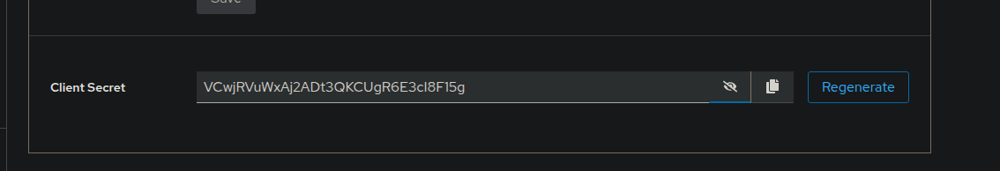
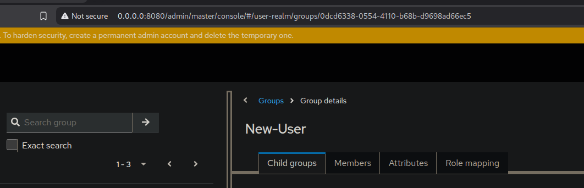
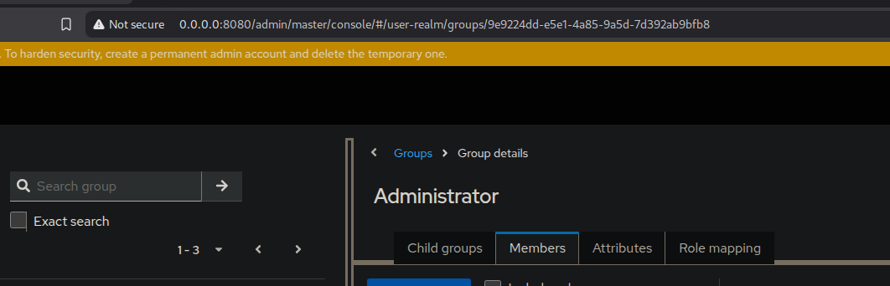

<h1 align="center">Initialization</h1>
 
# Content
-  [Configuring the environment file](#configuring-the-environment-file)
-  [Starting Services](#starting-services)
-  [Setting up the keycloak](#setting-up-the-keycloak)

<a name="configuring-the-environment-file"></a>
## Configuring the environment file

We have provided a **.env** file in repo. 
Just need to add new values for application to boot up.

- Postgres Password URL
```
  PSQL_PASSWORD=anything
```

- Postgres database Password for Keycloak
```
  POSTGRES_KEYCLOAK_PASSWORD=breach
```

- Keycloak Admin username and password
```
  KEYCLOAK_ADMIN_USERNAME=admin-user
  KEYCLOAK_ADMIN_PASSWORD=admin-password
```

<a name="starting-services"></a>
## Starting Services

First of all we will need docker engine to run the services.
- Install **docker engine** from [here](https://docs.docker.com/engine/install/).

Then run only keycloak container to set up rest of the important env variables.
```bash
  docker-compose up keycloak -d
```
Now go [here](#setting-up-the-keycloak) to follow instructions for setting up keycloak.

<a name="continue"></a>
After setting up keycloak,stop the running services and run the following command to start all the services.
```bash
  docker-compose up -d
```

- If you have a good amount of ram and powerful processor, you can run the following command to start all the services with **COMPOSE_BAKE** flag which build service simultaneously instead by iterating them.
```bash
  COMPOSE_BAKE=true docker-compose up --build -d
```

<a name="setting-up-the-keycloak"></a>
## Setting up the keycloak
After Keycloak service is successfully started, follow on page.
> http://0.0.0.0:8080/

- Login with the admin credentials provided in the .env file.
- Switch to user-realm and enter '**manav**' client to copy client credentials from Credential Section.



And copy it to :
```
#Client Secret Copy from Keycloak manav Client
KEYCLOAK_CLIENT_SECRET=
```

- Switch to Realm group row and copy the id from the **New-User** group.



> Copy id from URL

And paste it to :
```
#Keycloak Customer group ID
KEYCLOAK_GROUP_ID=
```

- Tab out to group **Administrator** group and copy the id from URL.



> Copy id from URL

And paste it to :
```
#Keycloak Admin Group ID
KEYCLOAK_ADMIN_GROUP_ID=
```

- After env file is set, go to
> http://0.0.0.0:8080/admin/master/console/#/user-realm/realm-settings/email

And set up the email settings for keycloak.

After Keycloak service is successfully configured go [here](#continue) to continue setting up the application.